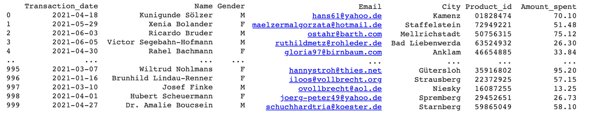

# Generating_Fake_Data_Python
An introduction on how to use the Faker library to generate fake dataset for any Data Science  or for Machine Learning projects.

This Python notebook will generate the following columns as examples:
- Transaction date (timestamp)
- Customer name (string)
- Gender (boolean)
- Email (string)
- City (string)
- Purchased product ID - barcode (string)
- Amount spent (float)

A snapshot of the output dataframe:

For full coverage on the content of this jupyter notebook, please visit the [Medium article](https://towardsdatascience.com/how-to-generate-dummy-data-in-python-a05bce24a6c6?sk=48023f37c38d9da1061eb22048cb74e9). 
